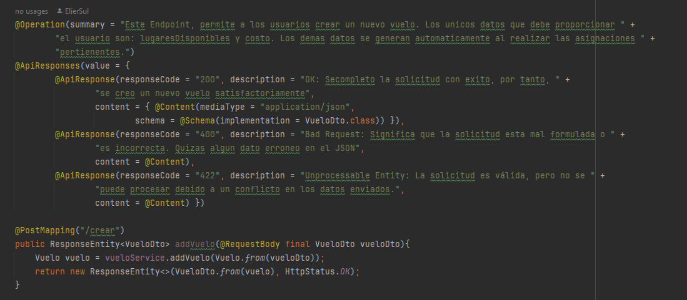
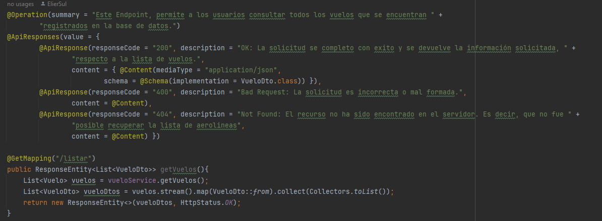
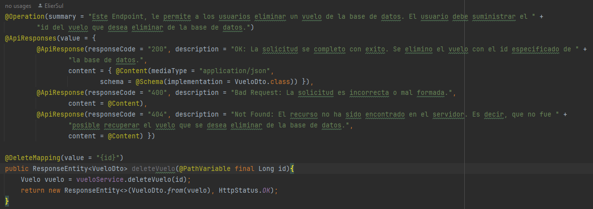
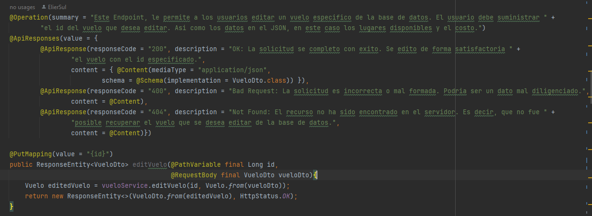
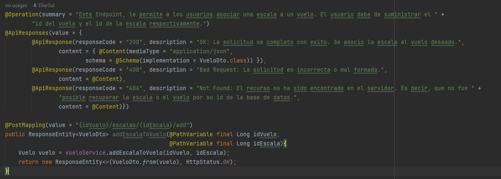
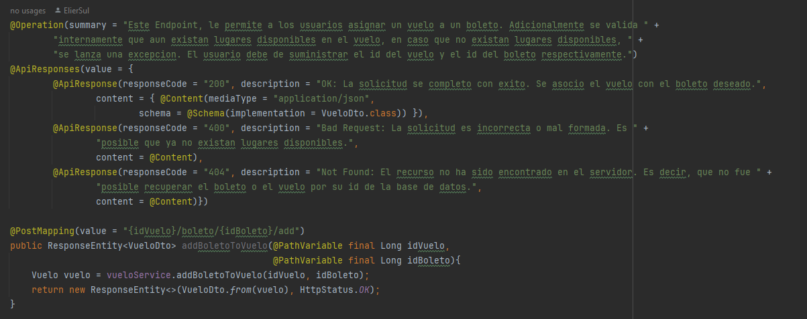
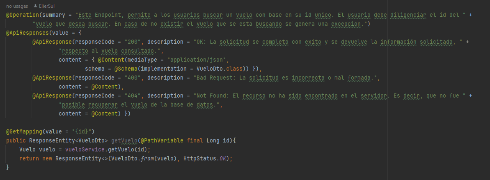
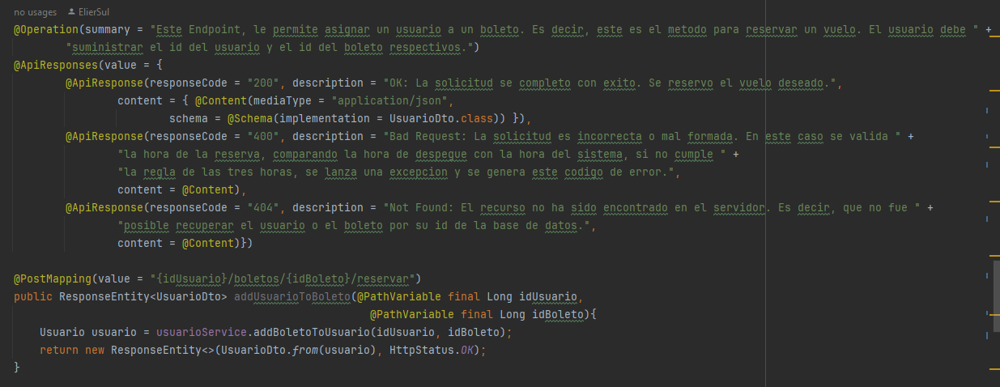

# AEROEXPRESSLATAM
Integrantes

Elier Sulbara, Valentina Valencia, David Rodriguez

A continuación se agrega la descripcion y el detalle del sistema de reserva de vuelos, el cual constituye el proyecto integrador entregado por la Organización Makaia

# Sistema de Reserva de Vuelos
El Sistema de Reserva de Vuelos o tambien llamado Aerolinea AeroExpres LATAM, es una solución informática diseñada para facilitar la gestión y reserva de vuelos para viajeros y compañías aéreas. Esta plataforma basada en la web brinda a los usuarios la posibilidad de buscar, visualizar y reservar vuelos

Contenido
1. Requisitos
2. Características
3. Documentacion
4. Uso

# Requisitos

Para el correcto despliegue del Sistema de Reserva de Vuelos (AeroExpressLatam), asegúrate de tener instalados los siguientes requisitos:

* Java 8 o superior
* Base de datos (MySQL)
* IDE Java IntelliJ opcional

# Caracteristicas 

El sistema de reserva de poder realizar las siguientes actividades 

1. Gestionar vuelos
2. Buscar vuelos por criterios de búsqueda
3. Reservar un vuelo
4. Manejo de excepciones
5. Despliegue
6. Documentacion con Swagger

   

1.1 Gestion de vuelos 

Para la gestion de los vuelos se utilizo endpoint. Un endpoint en el contexto de desarrollo de aplicaciones se refiere a una URL específica a la que se puede acceder en un servicio web o API. Los endpoints son puntos de acceso que permiten a los clientes de la API (aplicaciones, dispositivos, usuarios, etc.) interactuar con el sistema y realizar operaciones específicas.

Para la creacion de los vuelos se uso un endpoint, el cual permite crear o registrar los vuelos

En la gestion de vuelo, los desarrolladores implementaron nuevos criterios en el cual al usurio se le permite mostrar, eliminar,editar y deasociar la informacion de los vuelos 

Endpoint de mostras vuelos 

Endpoint de eliminar vuelos 

Endpoint de editar vuelos 

Endpoint para asociar un vuelo con una escala

Endpoint para desasociar un vuelo de una escala

Endpoint para asociar un vuelo y un boleto

Endpoint para desasociar un vuelo de un boleto

2.1 Buscar vuelos por criterios de busquedad

En este endpoint se hace las busqueda de criterio atravez de su id

3.1 Reservar un vuelo

Este endpoint, le permite al usuario hacer la reserva de un vuelo 

# Documentacion 

Modelado de diagrama de clases y entidad relacion, la creacion de estos modelados se diseñan con el objetivo de tener una visibilidad estructural del proyecto, para asi tener un desarrollo eficiente

MODELO ENTIDAD RELACION

DIAGRAMA DE CLASES

# Uso 

* Examina los vuelos disponibles y selecciona uno que se ajuste a tus necesidades.
* Realiza una reserva y completa el proceso de pago si es necesario.
* Los desarrolladores puede hacer uso de este proyecto, como punto de inicio para nuevos proyectos.

[Sistema de reservas de vuelos.pdf](https://github.com/ElierSul/Aerolinea/files/12842459/Sistema.de.reservas.de.vuelos.pdf)
